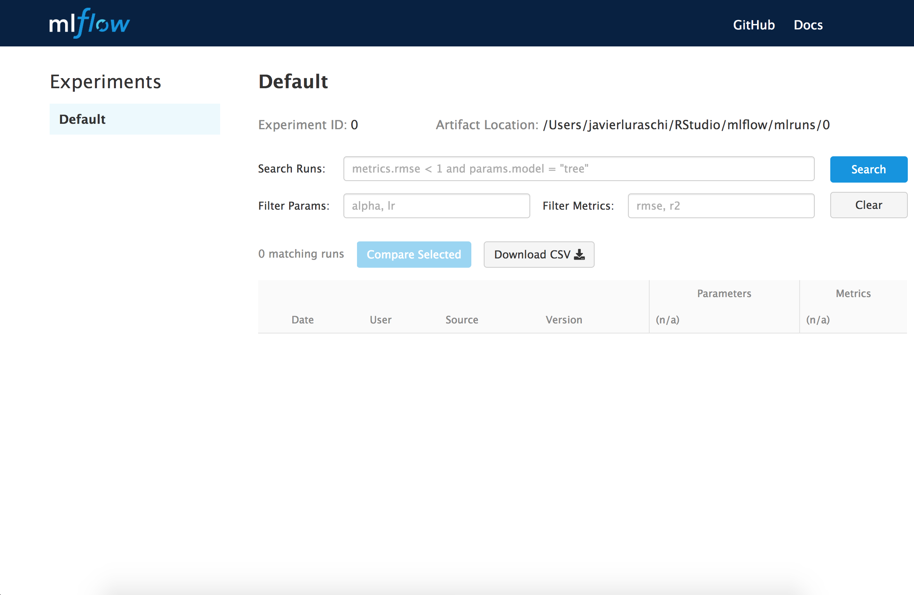
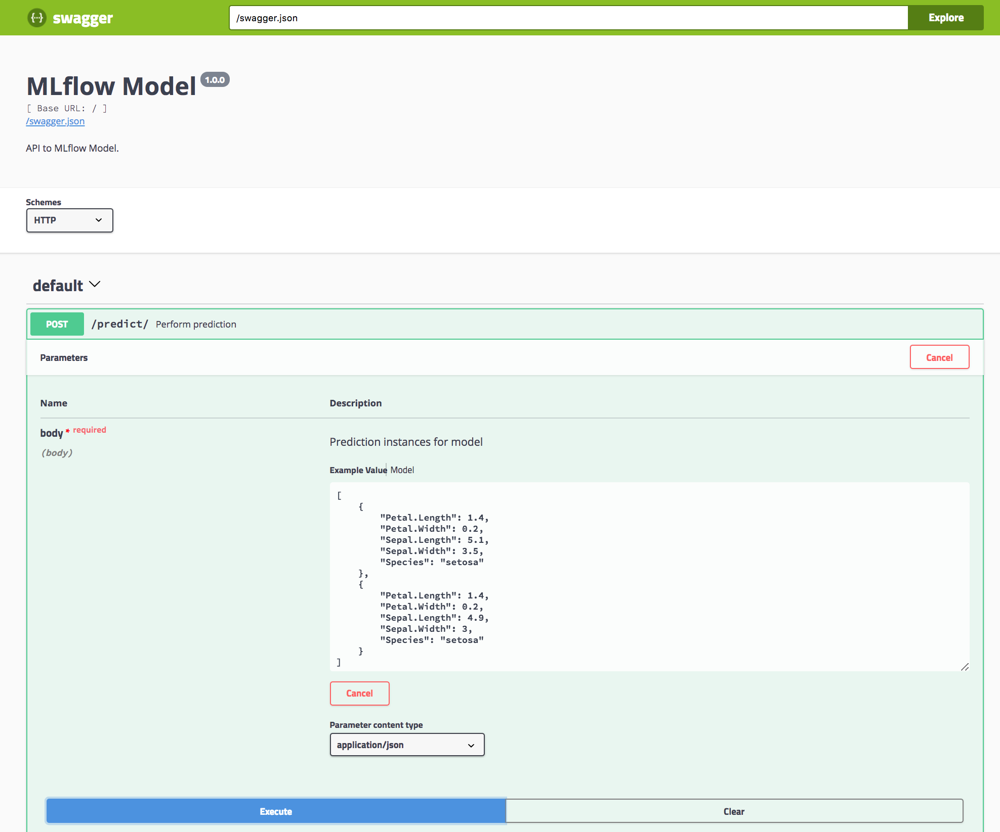
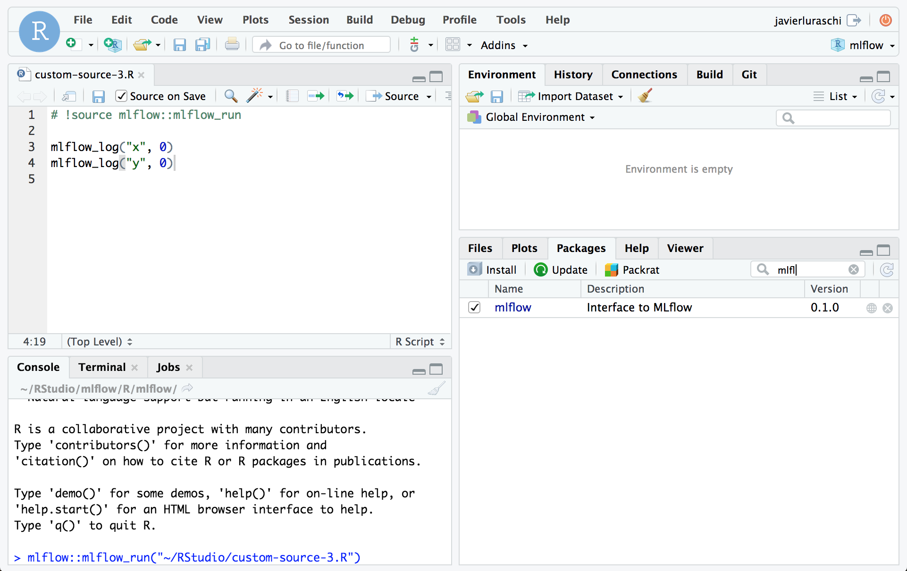

# qcflow: R interface for QCFlow

[](https://cran.r-project.org/package=qcflow)

- Install [QCFlow](https://qcflow.org/) from R to track experiments
  locally.
- Connect to QCFlow servers to share experiments with others.
- Use QCFlow to export models that can be served locally and remotely.

## Prerequisites

To use the QCFlow R API, you must install [the QCFlow Python package](https://pypi.org/project/qcflow/).

```bash
pip install qcflow
```

Optionally, you can set the `QCFLOW_PYTHON_BIN` and `QCFLOW_BIN` environment variables to specify
the Python and QCFlow binaries to use. By default, the R client automatically finds them using
`Sys.which("python")` and `Sys.which("qcflow")`.

```bash
export QCFLOW_PYTHON_BIN=/path/to/bin/python
export QCFLOW_BIN=/path/to/bin/qcflow
```

## Installation

Install `qcflow` as follows:

```r
devtools::install_github("qcflow/qcflow", subdir = "qcflow/R/qcflow")
```

## Development

Install the `qcflow` package as follows:

```r
devtools::install_github("qcflow/qcflow", subdir = "qcflow/R/qcflow")
```

Then install the latest released `qcflow` runtime.

However, currently, the development runtime of `qcflow` is also
required; which means you also need to download or clone the `qcflow`
GitHub repo:

```bash
git clone https://github.com/qcflow/qcflow
```

And upgrade the runtime to the development version as follows:

```bash
# Upgrade to the latest development version
pip install -e <local github repo>
```

## Tracking

QCFlow Tracking allows you to logging parameters, code versions,
metrics, and output files when running R code and for later visualizing
the results.

QCFlow allows you to group runs under experiments, which can be useful
for comparing runs intended to tackle a particular task. You can create
and activate a new experiment locally using `qcflow` as follows:

```r
library(qcflow)
qcflow_set_experiment("Test")
```

Then you can list view your experiments from QCFlows user interface by
running:

```r
qcflow_ui()
```



You can also use a QCFlow server to track and share experiments, see
[running a tracking
server](https://www.qcflow.org/docs/latest/tracking.html#running-a-tracking-server),
and then make use of this server by running:

```r
qcflow_set_tracking_uri("http://tracking-server:5000")
```

Once the tracking url is defined, the experiments will be stored and
tracked in the specified server which others will also be able to
access.

## Projects

An QCFlow Project is a format for packaging data science code in a
reusable and reproducible way.

QCFlow projects can be [explicitly
created](https://www.qcflow.org/docs/latest/projects.html#specifying-projects)
or implicitly used by running `R` with `qcflow` from the terminal as
follows:

```bash
qcflow run examples/r_wine --entry-point train.R
```

Notice that is equivalent to running from `examples/r_wine`,

```bash
Rscript -e "qcflow::qcflow_source('train.R')"
```

and `train.R` performing training and logging as follows:

```r
library(qcflow)

# read parameters
column <- qcflow_log_param("column", 1)

# log total rows
qcflow_log_metric("rows", nrow(iris))

# train model
model <- lm(
  Sepal.Width ~ x,
  data.frame(Sepal.Width = iris$Sepal.Width, x = iris[,column])
)

# log models intercept
qcflow_log_metric("intercept", model$coefficients[["(Intercept)"]])
```

### Parameters

You will often want to parameterize your scripts to support running and
tracking multiple experiments. Ypu can define parameters with type under
a `params_example.R` example as follows:

```r
library(qcflow)

# define parameters
my_int <- qcflow_param("my_int", 1, "integer")
my_num <- qcflow_param("my_num", 1.0, "numeric")

# log parameters
qcflow_log_param("param_int", my_int)
qcflow_log_param("param_num", my_num)
```

Then run `qcflow run` with custom parameters as
follows

    qcflow run tests/testthat/examples/ --entry-point params_example.R -P my_int=10 -P my_num=20.0 -P my_str=XYZ

    === Created directory /var/folders/ks/wm_bx4cn70s6h0r5vgqpsldm0000gn/T/tmpi6d2_wzf for downloading remote URIs passed to arguments of type 'path' ===
    === Running command 'source /miniconda2/bin/activate qcflow-da39a3ee5e6b4b0d3255bfef95601890afd80709 && Rscript -e "qcflow::qcflow_source('params_example.R')" --args --my_int 10 --my_num 20.0 --my_str XYZ' in run with ID '191b489b2355450a8c3cc9bf96cb1aa3' ===
    === Run (ID '191b489b2355450a8c3cc9bf96cb1aa3') succeeded ===

Run results that we can view with `qcflow_ui()`.

## Models

An QCFlow Model is a standard format for packaging machine learning
models that can be used in a variety of downstream tools—for example,
real-time serving through a REST API or batch inference on Apache Spark.
They provide a convention to save a model in different “flavors” that
can be understood by different downstream tools.

To save a model use `qcflow_save_model()`. For instance, you can add the
following lines to the previous `train.R` script:

```r
# train model (...)

# save model
qcflow_save_model(
  crate(~ stats::predict(model, .x), model)
)
```

And trigger a run with that will also save your model as follows:

```bash
qcflow run train.R
```

Each QCFlow Model is simply a directory containing arbitrary files,
together with an MLmodel file in the root of the directory that can
define multiple flavors that the model can be viewed in.

The directory containing the model looks as follows:

```r
dir("model")
```

    ## [1] "crate.bin" "MLmodel"

and the model definition `model/MLmodel` like:

```r
cat(paste(readLines("model/MLmodel"), collapse = "\n"))
```

    ## flavors:
    ##   crate:
    ##     version: 0.1.0
    ##     model: crate.bin
    ## time_created: 18-10-03T22:18:25.25.55
    ## run_id: 4286a3d27974487b95b19e01b7b3caab

Later on, the R model can be deployed which will perform predictions
using
`qcflow_rfunc_predict()`:

```r
qcflow_rfunc_predict("model", data = data.frame(x = c(0.3, 0.2)))
```

    ## Warning in qcflow_snapshot_warning(): Running without restoring the
    ## packages snapshot may not reload the model correctly. Consider running
    ## 'qcflow_restore_snapshot()' or setting the 'restore' parameter to 'TRUE'.

    ## 3.400381396714573.40656987651099

    ##        1        2
    ## 3.400381 3.406570

## Deployment

QCFlow provides tools for deployment on a local machine and several
production environments. You can use these tools to easily apply your
models in a production environment.

You can serve a model by running,

```bash
qcflow rfunc serve model
```

which is equivalent to
running,

```bash
Rscript -e "qcflow_rfunc_serve('model')"
```



You can also run:

```bash
qcflow rfunc predict model data.json
```

which is equivalent to running,

```bash
Rscript -e "qcflow_rfunc_predict('model', 'data.json')"
```

## Dependencies

When running a project, `qcflow_snapshot()` is automatically called to
generate a `r-dependencies.txt` file which contains a list of required
packages and versions.

However, restoring dependencies is not automatic since it’s usually an
expensive operation. To restore dependencies run:

```r
qcflow_restore_snapshot()
```

Notice that the `QCFLOW_SNAPSHOT_CACHE` environment variable can be set
to a cache directory to improve the time required to restore
dependencies.

## RStudio

To enable fast iteration while tracking with QCFlow improvements over a
model, [RStudio 1.2.897](https://dailies.rstudio.com/) an be configured
to automatically trigger `qcflow_run()` when sourced. This is enabled by
including a `# !source qcflow::qcflow_run` comment at the top of the R
script as
follows:



## Contributing

See the [QCFlow contribution guidelines](https://github.com/qcflow/qcflow/blob/master/CONTRIBUTING.md).
